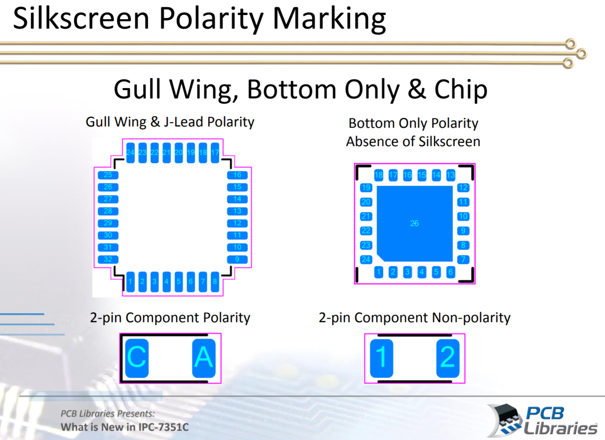

# Contributing
Any DTU ELE student can feel free to contribute to the communal DTU ELE Library. However we have a set of guidelines for the components and the footprints.

In order to have a coherent structure please follow the upcomming rules and requirements for schematic symbols and footprints.

## Rules and Requirements

### Vault components

When generating components for the vault, using the standard template will include most of the required parameters

#### Component Descriptions

___
### Schematic Symbols
All schematic symbols must be drawn on a mil grid. 

#### Designators
All components must in general include a meaningful designator.

| Designator    | Component Type						|
| --- 			| --- 									|
| BR 			| Bridge Rectifier						|
| BT 			| Battery								|
| C 			| Capacitor 							|
| D 			| Diode/LED								|
| DS 			| Display 								|
| F 			| Fuse 									|
| FB 			| Ferrite bead  						|
| FD 			| Fiducial 								|
| H 			| Hardware (mounting screws, etc) 		|
| IC 			| Generic ICs 							|
| J 			| Jack, fixed part of a connector pair 	|
| JP 			| Jumper / link 						|
| K 			| Relay  								|
| L 			| Inductor 								|
| LS 			| Loudspeaker or buzzer 				|
| MT 			| Motor 								|
| MK 			| Microphone 							|
| P 			| Connector 							|
| R				| Resistor								|
| RN 			| Resistor network 						|
| RT 			| Thermistor 							|
| RV 			| Varistor 								|
| SW 			| Switch 							 	|
| T 			| Transformer						 	|
| TC 			| Thermocouple 							|
| TP 			| Test point						 	|
| TR 			| Transistor						 	|
| Y 			| Crystal / oscillator 					|
| Z 			| Zener diode 							|

#### Pin length & Font size
This section covers requirements for pins. All pins must be placed on a minimum of 100 mil grid with multiples of 50 mil. Drawings can be drawn with any sized grid.

Font size = 6
Pin length = minimum 100 mil maximum 300 mil, steps of 100 allowed

#### Symbol outline and fill
This section describes the fill and component outline. By default symbols should follow the guidelines listed below:

1. Symbol outline
	* Width = small
	* Color = black or default blue
2. Component fill
	* Background color = white

#### Other guidelines for schematic symbols
* Logic components such as AND, NAND, NOR, Opamp, Comparators etc should be drawn as individual parts. That way a single AND of a QUAD-AND can be placed individually. This improves the schematic readability.
* Optocouplers and current-mirror integrated components can be drawn as individual parts or in the same package
* Make the component as detailed as possible. For instance MOSFET body-diode, NPN/PNP BJT gate-resistor for logic devices.

#### Safety critical components
If the component is safety critical (X/Y capacitor for instance) it must be clearly marked, and it should note that the component is safety critical requiring at least xxxx of voltage/tolerance/standard. An X/Y capacitor should for instance include a parameter called “Suppression Class” for the required class, say Y2.

The safety mark could look like this:

	

In this manner, the user/designer will easily catch on to the importance of the safety rated component.

#### Confidential components
Confidential components and projects should under no circumstances be located on the Altium Vault. All confidential content must be handled according to the rules set by the specific project.

___
### Footprints
This section covers rules and standards for footprint naming convention and used layers for documentation, assembly and 3d models.

By default footprints should follow the existing footprint and land pattern standard. The current IPC standard is IPC-7351B.

#### Naming convention
INCLUDE MORE GENERIC NAMING CONVENTION OTHER THAN MANFUACTURER VENDOR CODES

For manufacturer specific footprints or footprints made according to a given manufacturer's specifics, the naming must carry the manufacturer name according to Altium's default [Vendor Codes](https://techdocs.altium.com/display/ADOH/Vendor+Codes).

For manufacturers not listed in Altium's default vendor codes, use the following underneath. If you do experience a manufacturer often used and not present on either lists, please make a pull request.

| Company         						| Abbreviation 	|
| ---					 				| --- 			|
| Cinch Connectivity Solutions 			| CCS 			|
| Micro Commercial Components 			| MCC 			|
| Nexperia 								| NEXP 			|
| Schurter 								| SCHU 			|
| Vishay 								| VISH 			|
| Wurth Elektronik						| WUE 			|

#### Pad shapes

#### Pin 1 location

#### Layers

| Layer         	| Description                                                       	|
| --- 				| --- 																	|
| Overlay			| Silkscreen															|
| Mechanical 2 		| Top Assembly 															|
| Mechanical 3 		| Bottom assembly 													 	|
| Mechanical 4  	| Top component courtyard and center point								|
| Mechanical 5  	| Bottom component courtyard and center point							|
| Mechanical 6 		| Top 3d model and component outline  									|
| Mechanical 7 		| Bottom 3d model and component outline 								|
| Mechanical 8 		| Reserved for PCB notes (manufacturer)	 								|
| Mechanical 9 		| Reserved for PCB notes (in-house)										|
| Mechanical 10 	| Reserved for top side dimensions  									|
| Mechanical 11 	| Reserved for bottom side dimensions 									|
| Mechanical 27 	| Reserved for PCB board outlines 					 					|

##### Overlay (silkscreen)
The overlay is the silkscreen layer. This layer most often contains a part of the component outline, pin 1 reference and designator.

The overlay layer is not mandatory to include, but it often increases the overview of the PCB as well as improves the assembly process.

1. Silkscreen linewidth = 0.1mm <= 0.15 mm
2. Reference designator must be drawn directly on the silkscreen layer
	* Text size = 1 mm
	* Text width = 0.15 mm
3. Silkscreen must not be placed over pads or areas of exposed copper
	* Clearance between silkscreen and exposed copper elements must be at least 0.2mm.
4. Silkscreen outlines should be inside placement courtyard
	* Only exception is pin count on connectors
5. For SMD footprints, silkscreen must be fully visible after boards assembly (no silkscreen allowed under component)
6. For through-hole components, silkscreen may be placed under component to aid in assembly process
7. Pin 1 is identified by extending the silkscreen along Pin 1 length of pads
when component leads extend outward.

Pin identification on silkscreen is shown in the following figure:

	

##### Mechanical 2/3 - Assembly layer
This layer is used for a PDF printout of where which components must be placed. This allows the designer and/or manufacturer ease of design process as well as manufacturing verification.

The following layers cover the assembly layers:
* Mechanical 2 = Top assembly
* Mechanical 3 = Bottom assembly

The assembly layer must contain:
1. A component outline (can be the same as 3d model outline)
	* Maximum or nominal body size
	* Text width = 0.1 mm
2. A ".Designator" special string in the center of component to show designator
	* Font = TrueType
	* Text size = 0.5 mm
3. Components like diodes, ICs and polarized capacitors must clearly mark pin 1, cathode or negative terminal
	* Pin 1 mark should be a bevel
		* 1 mm or 25% of package size (whichever is greatest)
4. All designators must where applicable be located inside the component outuline

##### Mechanical 4/5 - Courtyard and center point
The courtyard is used to describe the distance from the component and land patterns to components around. [IPC-7251](http://www.ipc.org/committee/drafts/1-13_d_7251WD1.pdf) is a standard for land patterns and describes the point and requirements for courtyard excess.

The following layers cover the courtyards:
* Mechanical 4 = Top courtyard
* Mechanical 5 = Bottom courtyard

For courtyards the following rules apply:
1. By default courtyard follows the nominal board densities
	* Courtyard excess = 0.25 mm (Level-B nominal density)
	* Measure courtyard excess from mechanical or electrical limiting factor (can be either pads or 3d model outline)
2. Courtyard linewidth = 0.05 mm
3. The courtyard layer must contain a crosshair at a component's center of gravity
	* For complex components crosshair can be placed at component origin
	* Draw crosshair with 0.05 mm wide lines
	* Draw crosshair with 1 mm long lines
4. Bottom layer can contain courtyard as well, if the component requires so. The sames rules apply as for the top layer, although crosshair can be left out

##### Mechanical 6/7 - 3d model and component outline
All components (except for complex components like transformers and inductors) must contain a suitable 3d model. This allows the designer to make a mechanical verification of the PCB.

The following layers cover 3d models and component outlines:
* Mechanical 6 = Top 3d body
* Mechanical 7 = Bottom 3d body

For the 3d layers the following rules apply:
1. 3d models can either be:
	* Exact models found on the internet (watch licensing rules) or,
	* Squared boxes equivalating the mechanical constraints of the component
2. The 3d model must be placed on the layer, on which it is physically located
3. The 3d model must be oriented as per the footprint's dictation
4. Around the 3d model a component outline must be drawn in the same layer
	* Line width = 0.1 mm

#### Mechanical 8, 9, 10, 11 and 27
The mentioned layers are restricted from component footprints, unless the footprint contains explicit limits/boundaries for the manufacturer or in-house to know.

## Licenses
Under no circumstances must any licensed content excluding academic use be used in the building of the components. This in general applies to especially 3d models found on the internet.

## Online Guides
If you are interesed in further knowledge in the proper way of handling large scale libraries, we can recommend the following links:

[What is new in IPC-7351C](http://www.ocipcdc.org/archive/What_is_New_in_IPC-7351C_03_11_2015.pdf)

[KiCad Library Conventions](http://kicad-pcb.org/libraries/klc/)

[Component Development best practices - Part 1](https://resources.altium.com/pcb-design-blog/component-development-best-practices-part-1)

[What's in a Name - Component Development Part 2](https://resources.altium.com/pcb-design-blog/whats-in-a-name-component-development-part-2)

[What's the best way to make a library searchable? Parameters - Component Development Part 3](https://resources.altium.com/pcb-design-blog/whats-the-best-way-to-make-a-library-searchable-parameters-component-development-part-3)

