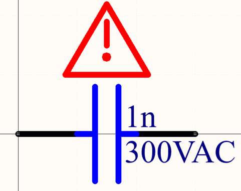

# Contributing
Any DTU ELE student can feel free to contribute to the communal DTU ELE Library. However we have a set of guidelines for the components and the footprints.

In order to have a coherent structure please follow the upcomming rules and requirements for schematic symbols and footprints.

## Rules and Requirements

### Vault components
When generating components for the vault, using the standard template will include most of the required parameters

<!-- ### Schematic Symbols
This section contains the rules and guidelines for the schematic symbols.
* Always drawn in mils on a 50 mil grid
* Symbol comment and desciption must be filled

#### Must have parameters
The following parameters are a bare minimum, and must be written in the given format.
* Manufacturer
* Manufacturer part number
* Published (when was this model released, yyyy-mm-dd)
* Publisher (who created it, initials or full name)
* Datasheet version (write as given in datasheet)
* Link to used datasheet (preferably the given manufacturer)

#### Nice-to-have parameters
These are nice-to-have parameters, used for quick and easy BOM generation and symbol assessment.
* PackageDescription
* PackageReference
* Farnell part number
* Digikey part number
* Mouser part number
* RSonline part number
* Tolerance
* Voltage rating (note if AC or DC)
* Dielectric/material (dielectric if capacitor, material if a specific resistor)
* Alternative parameters such as current, voltage, operating temperature and etc
 -->
#### Designators
All components must in general include a meaningful designator.

| Designator    | Component Type						|
| --- 			| --- 									|
| BT 			| Battery								|
| C 			| Capacitor 							|
| D 			| Diode/LED								|
| DS 			| Display 								|
| F 			| Fuse 									|
| FB 			| Ferrite bead  						|
| FD 			| Fiducial 								|
| H 			| Hardware (mounting screws, etc) 		|
| IC 			| Generic ICs 							|
| J 			| Jack, fixed part of a connector pair 	|
| JP 			| Jumper / link 						|
| K 			| Relay  								|
| L 			| Inductor 								|
| LS 			| Loudspeaker or buzzer 				|
| MT 			| Motor 								|
| MK 			| Microphone 							|
| P 			| Connector 							|
| R				| Resistor								|
| RN 			| Resistor network 						|
| RT 			| Thermistor 							|
| RV 			| Varistor 								|
| SW 			| Switch 							 	|
| T 			| Transformer						 	|
| TC 			| Thermocouple 							|
| TP 			| Test point						 	|
| TR 			| Transistor						 	|
| Y 			| Crystal / oscillator 					|
| Z 			| Zener diode 							|

#### Font size
#### Symbol outline and fill

#### Other guidelines for schematic symbols
* Logic components such as AND, NAND, NOR, Opamp, Comparators etc should be drawn as individual parts. That way a single AND of a QUAD-AND can be placed individually. This improves the schematic readability.
* Optocouplers and current-mirror integrated components can be drawn as individual parts or in the same package
* Make the component as detailed as possible. For instance MOSFET body-diode, NPN/PNP BJT gate-resistor for logic devices.

#### Safety critical components
If the component is safety critical (X/Y capacitor for instance) it must be clearly marked, and it should note that the component is safety critical requiring at least xxxx of voltage/tolerance/standard. An X/Y capacitor should for instance include a parameter called “Suppression Class” for the required class, say Y2.

The safety mark could look like this:

	

In this manner, the user/designer will easily catch on to the importance of the safety rated component.

#### Confidential components
FIND A WAY TO DEAL WITH CONFIDENTIAL STUFF!!! Maybe they should not be included in the Altium library at all.

### Footprints

#### Naming convention
For manufacturer specific footprints or footprints made according to a given manufacturer's specifics, the naming must carry the manufacturer name according to Altium's default [Vendor Codes](https://techdocs.altium.com/display/ADOH/Vendor+Codes).

| Company         	| Abbreviation 	|
| Nexperia 			| NEXP 			|

#### Layers

| Layer         	| Description                                                       	| Line Width 	|
| --- 				| --- 																	| --- 			|
| Overlay			| Silkscreen															| 0.2 mm 		|
| Mechanical 2 		| Top assembly, component outline and .Designator string in middle 		| 0.1 mm 		|
| Mechanical 3 		| Bottom assembly, component outline and .Designator string in middle 	| 0.1 mm 		|
| Mechanical 4  	| Top component courtyard and center point								| 0.1 mm 		|
| Mechanical 5  	| Bottom component courtyard and center point							| 0.1 mm 		|
| Mechanical 6 		| Top 3d model and component outline  									| 0.1 mm 		|
| Mechanical 7 		| Bottom 3d model and component outline 								| 0.1 mm 		|
| Mechanical [8-10]	| Text/ruler/notes for 						                   			| 0.1 mm 		|
| Mechanical 27 	| Reserved for PCB board outlines 					 					| N/A 	 		|

##### Overlay
The overlay is the silkscreen layer. This layer most often contains a part of the component outline, pin 1 reference and designator.

The overlay layer is not mandatory to include, but it often increases the overview of the PCB as well as improves the assembly process.

1. Reference designator must be drawn directly on the silkscreen layer
* Text size must be 1 mm high
* Text width must be 0.15 mm
2. Silkscreen must not be placed over pads or areas of exposed copper
* Clearance between silkscreen and exposed copper elements must be at least 0.2mm.
3. Silkscreen outlines should be inside placement courtyard
4. For SMD footprints, silkscreen must be fully visible after boards assembly (no silkscreen allowed under component)
5. For through-hole components, silkscreen may be placed under component to aid in assembly process
6. Pin 1 is identified by extending the silkscreen along Pin 1 length of pads
when component leads extend outward.

	

##### Mechanical 2/3 - Assembly layer
This layer is used for a PDF printout of where which components must be placed. This way people can easily assess that this one is IC1, R32 here and the like without the need for bulky silkscreen.

The assembly layer must contain a 'special string', ".Designator" in the middle of the placement body assigning the designator of the component. The standard size for this is 0.5 mm height.

Special attention must be brought to components like polarized capacitors, diodes and ICs with numbers. Said packages' assembly layers must easily assess in which direction pin 1 (or cathode) is oriented.

##### Mechanical 4/5 - Courtyard and center point
Mechanical 4 and 5 layers must be setup as a layer pair, so the component courtyard and reference origin automatically switches layers as well.

The courtyard is used to describe the distance from the component and land patterns to components around. [IPC-7251](http://www.ipc.org/committee/drafts/1-13_d_7251WD1.pdf) is a standard for land patterns and describes the point and requirements for courtyard excess.

In the DTU Altium Library nominal courtyard excess is used: 0.25 mm from the outer bondaries of the component. This value is measured from the center of the 3d-outline line. The center point is made of a "cross" with 0.1mm wide 1mm lines.

##### Mechanical 6/7 - 3d model and component outline
The 3d model is often made with a "place -> 3d body" and can either be a simple "box" with the width, length and height of the actual component. The component outline outlines with a 0.1 mm wide lines where the 3d body ends.

## Licenses
Under no circumstances must any licensed content excluding academic use be used in the building of the components. This in general applies to especially 3d models found on the internet.

## Online Guides
If you are interesed in further knowledge in the proper way of handling large scale libraries, we can recommend the following links:

[What is new in IPC-7351C](http://www.ocipcdc.org/archive/What_is_New_in_IPC-7351C_03_11_2015.pdf)

[KiCad Library Conventions](http://kicad-pcb.org/libraries/klc/)

[Component Development best practices - Part 1](https://resources.altium.com/pcb-design-blog/component-development-best-practices-part-1)

[What's in a Name - Component Development Part 2](https://resources.altium.com/pcb-design-blog/whats-in-a-name-component-development-part-2)

[What's the best way to make a library searchable? Parameters - Component Development Part 3](https://resources.altium.com/pcb-design-blog/whats-the-best-way-to-make-a-library-searchable-parameters-component-development-part-3)

